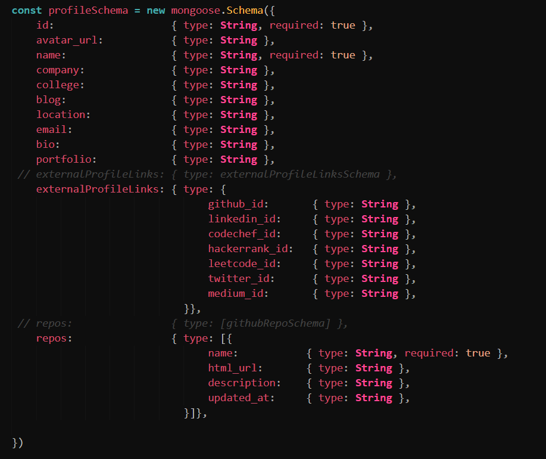

# Winter of Code 2021 Final Contribution Report

## Organisation Name : Devprofile
## Mentored by :
## FirstName LastName

## Overview

### Contributions

- Integrated the client and server folders into one parent folder and added the following scripts for interacting with the project.
    - **init**: executing `npm run init` installs all the dependencies of the project folder, client folder and the server folder all at once, eliminating the need to install dependencies manually in all the three folders after cloning the repo.
    - **client**: running `npm run client` goes inside the client folder and runs `npm start` on it's own hence starting the client react app.
    - **server**: running `npm run server` goes inside the server folder and starts the server with nodemon.
    - **dev**: running `npm run dev` executes both `npm run client`(the client) and `npm run server`(the server) simultaneously using the package `concurrently`.

- Added MongoDB as the primary database and connected the app with the DB.

- Added the following schemas for the DB:
    - **Profile Schema**:
    

- Added the following API routes in the server: (by default `$url` is `http://localhost:8000/api`)
    - **POST** `$url/profile/create`: accepts a JSON with the following format. **Validation is built in** to check if the required fields are provided and if the user is sending valid urls wherever needed. On successful validation, the data is saved on the MongoDB database.
    
        ```json
        {
            "id": "thehalfbloodprince", /* this is required */
            "avatar_url": "https://avatars.githubusercontent.com/u/66899?v=4",
            "name": "Snape", /* this is required */
            "company": "Hogwarts School of Witchcraft and Wizardry",
            "college": "Hogwarts School of Witchcraft and Wizardry",
            "blog": "https://thebookofthehalfbloodprince.com",
            "location": "Spinner's End, Cokeworth, England",
            "email": "snape@hogwarts.edu",
            "bio": "Turn to page 394.",
            "portfolio": "https://severussnape.com",
            "externalProfileLinks": {
                /* these must be valid urls or else the server throws error */
                "github_id": "thehalfbloodprince",
                "linkedin_id": "https://linkedin.com/thehalfbloodprince",
                "codechef_id": "https://codechef.com/thehalfbloodprince",
                "hackerrank_id": "https://hackerrank.com/thehalfbloodprince",
                "leetcode_id": "https://leetcode.com/thehalfbloodprince",
                "twitter_id": "https://twitter.com/thehalfbloodprince",
                "medium_id": "https://medium.com/thehalfbloodprince"
            },
            "repos": [
                {
                    "name": "Sectumsempra",
                    "html_url": "https://github.com/thehalfbloodprince/Sectumsempra",
                    "description": "A curse to... that's a secret",
                    "updated_at": "2020-08-12T18:21:53Z"
                },
                {
                    "name": "Ideas of torturing Harry Potter generator",
                    "html_url": "https://github.com/thbp/hehe",
                    "description": "A list of awesome resources for learning to improve your life",
                    "updated_at": "2020-08-12T18:21:53Z"
                }
            ]
        }
        ```
        
    -  **GET** `$url/profile/find/$id`: the id is the github username of the user. This API sends the following JSON as output:

        1. if that user's profile exists on the DB:
            ```json
            {
                /* data contains the profile object saved in the DB */
                data: {
                    id: /* the github username */
                    name: /* the profile name */
                    ...
                },
                found: true
            }
            ```
        2. if that user's profile does not exist on the DB:
            ```json
            {
                /* no data object */
                found: false
            }
            ```

    - **PUT** `$url/profile/edit/$id`: sending the properties of the profile you want to edit in the same structure as the POST API edits those details in the DB.

        eg. sending this JSON to the API
        ```json
        {
            "id": "thehalfbloodprince",
            "name": "Grindelwald",
            "company": "xD"
        }
        ```
        would modify the user's name to 'Grindelwald' and company to 'xD'.

        **NOTE**: 
            1. the API checks if the user is logged in before accepting the JSON and also the loggedin user must be the same as the id provided in the JSON. The API checks the accesstoken in the header of the request to verify that. So, if you want to test it out in external testing tools like Postman, you would need to once login using the client and get the accesstoken which is printed in the console for now and then send a header named: `access-token` which should have the accesstoken as the value. This will be used by the API to get the loggedin user.
            2. `id` field **MUST BE SENT** even if you are not attempting to change it.

- Added logger using `Winston` for logging errors, exceptions and rejections to a logfile for easy future reference.
- Added Redux using redux toolkit to handle user data across the app.
- user's devprofile page:
- Chart for showing languages used by the user.
- added data fetching in the user's devprofile page and dynamically rendering them in the page.

**PR Links**: 
    - [Restructured file structure into frontend and backend](https://github.com/dscnsec/devprofile/pull/1)
    - [Restructured file structure into frontend and backend](https://github.com/dscnsec/devprofile/pull/1)
    - [Restructured file structure into frontend and backend](https://github.com/dscnsec/devprofile/pull/1)
    - [Restructured file structure into frontend and backend](https://github.com/dscnsec/devprofile/pull/1)
    - [Restructured file structure into frontend and backend](https://github.com/dscnsec/devprofile/pull/1)
 
# Future Scope

# Overall Experience
